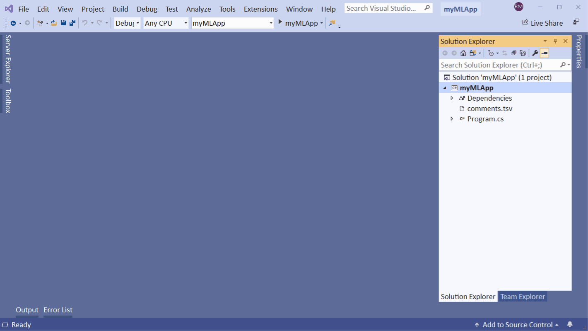

# Model Builder

Model Builder is a UI tool in Visual Studio that lets you build, train and consume custom machine learning models in your applications.

With little to no machine learning expertise you can use this visual interface to connect to your data stored in files or SQL Server.

Model Builder leverages best in class automated machine learning (AutoML) to train and evaluate different algorithms. It produces the best model for your scenario and data without any tuning required from you.

After training, you can generate code for training and consuming this model in their applications.

Get started with Model Builder using the following resources:

- [Installation](https://github.com/dotnet/machinelearning-samples/blob/master/modelbuilder/readme.md#Installation)
- [Getting started tutorial](https://dotnet.microsoft.com/learn/machinelearning-ai/ml-dotnet-get-started-tutorial/intro)
- [Documentation](https://aka.ms/modelbuilderdocs)
- [Limitations](https://github.com/dotnet/machinelearning-samples/blob/master/modelbuilder/readme.md#Limitations)

## Installation

### Prerequisites

- Visual Studio 2022 or Visual Studio 2019
- .NET Core 3.1 SDK or later

Model Builder is built into Visual Studio 2022 and Visual Studio 2019. For installation instructions, see the [Model Builder installation guide](https://docs.microsoft.com/dotnet/machine-learning/how-to-guides/install-model-builder?tabs=visual-studio-2022).

Alternatively, you can install Model Builder from the Visual Studio marketplace

- [Model Builder for Visual Studio 2022](https://marketplace.visualstudio.com/items?itemName=MLNET.ModelBuilder2022)
- [Model Builder for Visual Studio 2019](https://marketplace.visualstudio.com/items?itemName=MLNET.07)

## Limitations

- ML.NET Model Builder Extension currently only works on Visual Studio on Windows.

## How can I contribute?

Help us improve ML.NET tooling by filing issues and providing feedback on feature requests and bugs. For general guidance, see the [filing an issue guide](./file-an-issue.md).  

## Legal Notices

.NET Foundation and any contributors grant you a license to the .NET Foundation documentation and other content
in this repository under the [Creative Commons Attribution 4.0 International Public License](https://creativecommons.org/licenses/by/4.0/legalcode),
see the [LICENSE](LICENSE) file, and grant you a license to any code in the repository under the [MIT License](https://opensource.org/licenses/MIT), see the
[LICENSE-CODE](LICENSE-CODE) file.

Microsoft, Windows, Microsoft Azure and/or other Microsoft products and services referenced in the documentation
may be either trademarks or registered trademarks of Microsoft in the United States and/or other countries.
The licenses for this project do not grant you rights to use any Microsoft names, logos, or trademarks.
Microsoft's general trademark guidelines can be found at http://go.microsoft.com/fwlink/?LinkID=254653.

Privacy information can be found at https://privacy.microsoft.com/en-us/

.NET Foundation and any contributors reserve all other rights, whether under their respective copyrights, patents,
or trademarks, whether by implication, estoppel or otherwise.
